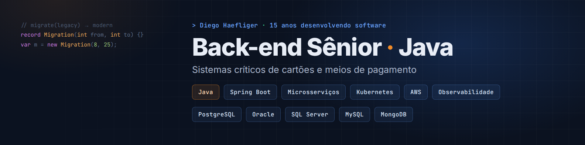

## Olá, eu sou o Diego 👋

Desenvolvedor **Back-end Sênior** com 15 anos em desenvolvimento de software, especializado em **Java** e em sistemas críticos do domínio de **cartões e meios de pagamento**.

- 💳 Atuei no squad de cartões transacionais da **Porto**: microsserviços em produção, sustentação e observabilidade
- 🔄 Conduzi a migração de **5 projetos legados de Java 8 para Java 21**
- 🌾 Antes disso, 10 anos em P&D no agronegócio: reescrevi um sistema de telemetria IoT de Delphi para Java, com dados em **tempo real**
- 🔐 MBA em Computação Forense e Segurança da Informação
- 🌎 Aberto a oportunidades **100% remotas** como Desenvolvedor Back-end Sênior Java

### 🛠️ Stack

---

### ⭐ Em destaque: [GithubIssuesGateway](https://github.com/DiegoHaefliger/GithubIssuesGateway)

**Triagem automatizada de erros de produção com agente de IA sob controle determinístico.**

Um alerta do Grafana vira um card no GitHub Issues com a evidência já coletada (logs, traces, métricas, deploys recentes). Um agente de IA investiga o erro num runner isolado e propõe teste e correção. Um **Policy Gate determinístico** verifica tudo por conta própria — aplica só o teste e exige vermelho, aplica a correção e exige verde, mede o diff e o raio de impacto — e decide se vira PR ou volta para um humano.

`Java 21` `Spring Boot 3.5` `PostgreSQL` `GitHub Actions` `Grafana · Loki · Prometheus · Tempo` `Docker`

---

### 🚀 Projetos públicos

| Projeto | O que é | Stack |
|---|---|---|
| [**CryptoMonitor**](https://github.com/DiegoHaefliger/CryptoMonitor) | Monitoramento de criptoativos em tempo real via WebSocket, com estratégias plugáveis (preço, média móvel, RSI) que publicam sinais no Kafka. Migrado de Spring Boot para Quarkus, com gates de qualidade (Spotless, Checkstyle, ArchUnit) | Java 21 · Quarkus · Kafka · PostgreSQL · Redis · Liquibase · WebSocket |
| [**CryptoMensageria**](https://github.com/DiegoHaefliger/CryptoMensageria) | Serviço de notificações que consome eventos do Kafka e os entrega em tempo real via bot do Telegram | Java 21 · Quarkus · Kafka · Telegram Bots API |
| [**Java_Kafka**](https://github.com/DiegoHaefliger/Java_Kafka) | Arquitetura de 5 microsserviços com **Saga orquestrada** (pedido, orquestrador, validação de produto, pagamento e estoque), com compensação em caso de falha | Java 17 · Spring Boot 3 · Kafka · PostgreSQL · MongoDB · Docker |
| [**CoreLog**](https://github.com/DiegoHaefliger/CoreLog) | Coleta e visualização centralizada de logs de arquivos e containers Docker em tempo real, com busca full-text. Entregue como binário único | Go · SQLite FTS5 · React · TypeScript |
| [**Movies**](https://github.com/DiegoHaefliger/Movies) | API REST que importa um CSV de filmes e calcula os intervalos entre premiações de produtores, com autenticação JWT | Java 17 · Spring Boot · H2 · Liquibase · JWT · JUnit 5 |
| [**Spring Boot + Liquibase**](https://github.com/DiegoHaefliger/Sping_Boot_Liquibase) | Versionamento de banco de dados com Liquibase em aplicações Spring Boot | Java 17 · Spring Boot · Liquibase · H2 |

### 🔒 Em desenvolvimento (privados)

| Projeto | O que é | Stack |
|---|---|---|
| **Argos** | Plataforma multiusuário de inteligência de vagas com IA: coleta vagas de várias fontes, analisa a aderência e notifica as melhores oportunidades | Java 25 · Spring Boot · LangChain4j · Kafka · Liquibase |
| **Bot de trading algorítmico** | Sistema automatizado em produção, com motor de estratégias plugável, gestão de risco, filtro de sinais com ML e alertas via Telegram | Java 21 · Quarkus · PostgreSQL · Kafka · WebSocket · Liquibase |

---

### 📫 Contato

